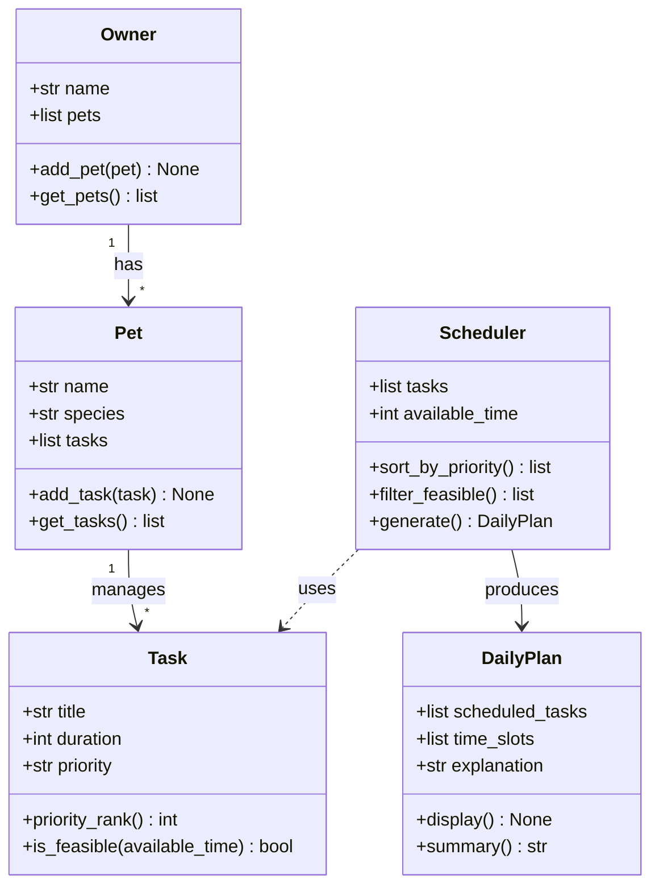

```mermaid
classDiagram
    class Owner {
        +str name
        +list pets
        +add_pet(pet) None
        +get_pets() list
    }

    class Pet {
        +str name
        +str species
        +list tasks
        +add_task(task) None
        +get_tasks() list
    }

    class Task {
        +str title
        +int duration
        +str priority
        +priority_rank() int
        +is_feasible(available_time) bool
    }

    class Scheduler {
        +list tasks
        +int available_time
        +sort_by_priority() list
        +filter_feasible() list
        +generate() DailyPlan
    }

    class DailyPlan {
        +list scheduled_tasks
        +list time_slots
        +str explanation
        +display() None
        +summary() str
    }

    Owner "1" --> "*" Pet : has
    Pet "1" --> "*" Task : manages
    Scheduler --> DailyPlan : produces
    Scheduler ..> Task : uses
```
